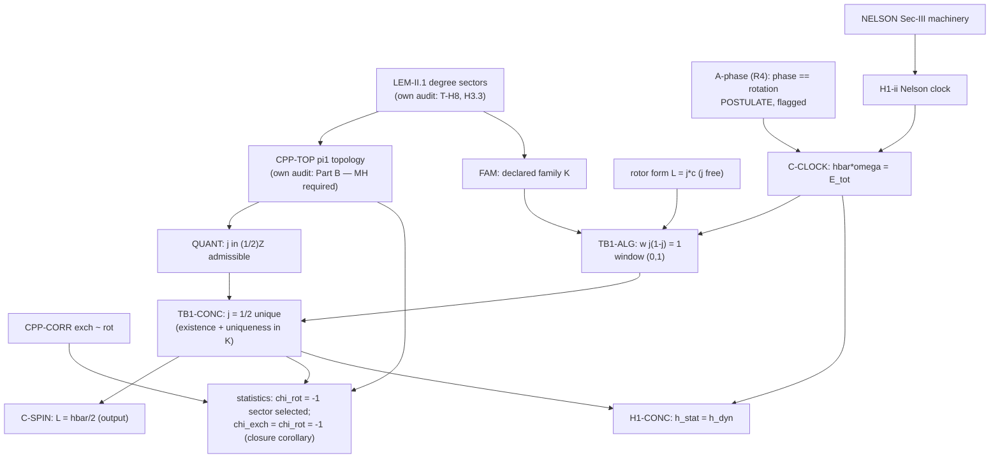

# H3.1 — PROOF STRUCTURE: THE CLOSURE CYCLE (T-H3) AND THEOREM c″ (T-H4)

**Auditor:** theory-audit subagent (Fable-class), 2026-07-16. Phase H3.1 of
ROADMAP_v5_THEORY.
**Charge:** T2 §a.5 flagged the closure system's citation structure as
DEFECT-CANDIDATE (the IV.B/IV.H.1(iii) ↔ c″ ↔ T-B1 loop) and T2 §b flagged
Theorem c″'s "identical dressed knots ARE fermions" [DF] as overreach with a
GAP-sketched Route 1 and a NOT-AUDITABLE Route 2. This memo does the
constructive work: (Part A) formalize the closure system as atomic statements,
build the dependency graph, locate the cycles, adjudicate vicious vs benign
edge-by-edge, and print the repair; (Part B) reconstruct the standard
Finkelstein–Rubinstein spin-statistics argument for the B = 1 sector at
literature grade, confirm or correct the corpus's unstratified core, identify
the minimal hypothesis that would earn the dressed extension, adjudicate
documentation-gap vs substantive, and attempt the Mayer–Vietoris route.
Argument-level, within-model only; nothing here bears on nature.

**Sources:** `substrate-suite/01-GUM-Omega-Paper-v2.0.1.md` Secs. III.C, IV.B,
IV.C, IV.H.1, IV.I, VII.F; Apps. F.1–F.6, G.3, G.5, I.4;
`theory-audit/T2_closure_pillars.md` §§a, b; `ROADMAP_v5_THEORY.md` (H2.6/H2.7
adjudications, T-ledger).
**Computations:** `theory-audit/h31_fr.py` — 31/31 checks pass (sympy exact
algebra; DFS cycle census on all three graphs; degree quadratures; SU(2)-lift
and explicit 4π null-homotopy certificates; finite exactness models for the
stratified underdetermination). Structured verdicts: `h31_summary.json`.
**Verdict vocabulary:** SOUND / GAP / DEFECT-CANDIDATE / NOT-AUDITABLE-FROM-TEXT,
as in T1/T2/T3.

---

# PART A — T-H3: is the closure cycle vicious or benign?

## A.0 The closure system as atomic statements

Every premise/conclusion of the system, one label each. Bracketed text is the
paper's own wording; the *content* column is what the statement actually
asserts, which is where the audit bites.

| label | locus | statement (as printed) | actual content |
|---|---|---|---|
| **LEM-II.1** | App F.1 | admissible deformations convex ⟹ degree conserved | the arena: configuration space splits into degree sectors (audited separately: T-H8, Phase H3.3) |
| **CPP-TOP** | App F.5 | π₁(𝒞_strat) = ℤ₂ × A; 2π-rotation loop generates the ℤ₂ | topology claim (Route 1/2; audited in Part B) |
| **CPP-CORR** | App F.3 | the exchange–rotation homotopy lifts to the stratified space | χ_exch = χ_rot in every quantization sector |
| **CPP-DF** | VII.F (7.6) | "χ_exch = χ_rot(2π) = −1: identical dressed knots ARE fermions" [DF] | the graded conclusion: the fermionic **value** forced |
| **QUANT** | implicit in "quantized on the SU(2) cover" | j ∈ ½ℤ admissible; both parity sectors consistent | the only j-content topology can supply: half-integer j admissible **iff** the rotation loop is π₁-nontrivial (see B.3.4) |
| **C-SPIN** | IV.B | "the internal rotor, quantized on the SU(2) cover (Theorem c″), carries L ≡ 𝕀ω = ħ/2" | rotor kinematics **plus the value j = ½**, cited to c″ |
| **C-CLOCK** | IV.B | "ħω = E_tot — which IV.H.1 will show is not an imposed equation but an identity" | the de Broglie condition, identity-status deferred to IV.H.1 |
| **H1-i** | IV.H.1(i) | the quantum phase is a real texture angle; for the isorotating knot it IS the internal rotation | ontological identification ω_phase ≡ ω_mech (asserted from III.C; T2's residual GAP) |
| **H1-ii** | IV.H.1(ii) | a Nelson-stationary state of energy E has ω_phase = E/𝔥_stat | sound Sec-III import, j-free |
| **H1-iii** | IV.H.1(iii) | "Theorem c″ forces j = ½: L = 𝔥_stat/2" | **misattribution** (T2 a.5): c″ contains no such content |
| **H1-CONC** | IV.H.1 | 𝔥_stat = 𝔠Λ√J = 𝔥_dyn: one consistency condition on the vacuum | needs (i)+(ii)+(iii) and solvability (IV.3-class) |
| **IV-3** | IV.B | determinacy: m̃ cancels; 𝔠 a pure number | uses C-SPIN + C-CLOCK + FAM |
| **FAM** | IV.C / App G.5 | BPS backbone × dilation V × SDiff-g family; E_field = (ê/2)(V⁻¹+V), 𝕀 = 𝔦₀gV | the restricted configuration family (F-R5 scope caveat carried) |
| **TB1-ALG** | IV.I | V² = 1 + j²w and 1 + V² = j(2−j)w ⟹ **w·j(1−j) = 1**, solvable iff 0 < j < 1; V² = 1/(1−j); E_rot/E = j/2 | sound algebra (T2-verified; re-verified exactly, h31_fr.py A1) |
| **TB1-CONC** | IV.I | "Half-integrality (Theorem c″) then leaves j = ½ unique" | j = ½ = ½ℤ ∩ (0,1); consumes QUANT, not CPP-DF |
| **NELSON** | Sec III | 𝔥_stat exists; stationary-state machinery | upstream, uncontested here |

## A.1 The dependency graph

### A.1.1 As printed (the "as-cited" graph)

Adjacency list (X → Y: statement Y's printed justification consumes X):

```
LEM-II.1 → {CPP-TOP, FAM}
CPP-TOP  → {CPP-DF}          # F.5's topology, graded up to "ARE fermions"
CPP-CORR → {CPP-DF}
CPP-DF   → {C-SPIN, H1-iii, TB1-CONC}   # the three "(Theorem c″)" citations
NELSON   → {H1-ii}
H1-i, H1-ii → {C-CLOCK, H1-CONC};  H1-iii → {H1-CONC};  IV-3 → {H1-CONC}
C-SPIN, C-CLOCK, FAM → {IV-3, TB1-ALG}
TB1-ALG  → {TB1-CONC}
```

**This graph is acyclic** (h31_fr.py A2, DFS census: zero elementary cycles).
That is itself a finding worth stating precisely: *as typeset, the corpus does
not print a circle.* It prints something that only looks acyclic because the
three "(Theorem c″)" citations point at a node (CPP-DF) whose actual content
does not include what is being cited. The paper cites c″ for "j = ½" (C-SPIN,
H1-iii) and for "half-integrality" (TB1-CONC); c″'s topology yields at most
QUANT — sector admissibility and the exchange–rotation correlation — never a
selected value of j (T2 a.5 item 2, confirmed).

### A.1.2 Content-resolved (the auditor's T-H3 graph)

Resolve each citation to the only in-corpus source of the cited **content**:

- "j = ½" is derived nowhere except TB1-CONC ⟹ the de-facto edges are
  **TB1-CONC → C-SPIN** and **TB1-CONC → H1-iii**;
- the forcing of the fermionic **value** (CPP-DF's [DF] grade) has no valid
  topological derivation (Part B / T2 b.3); its only candidate support is
  dynamical sector selection ⟹ **TB1-CONC → CPP-DF**;
- c″-as-topology legitimately supplies **CPP-TOP → QUANT** and
  **QUANT → TB1-CONC** (half-integrality premise, weakened to admissibility).

The cycle census on this graph (h31_fr.py A2) finds exactly two elementary
cycles:

- **Γ1:** `C-SPIN → TB1-ALG → TB1-CONC → C-SPIN`
- **Γ2:** `CPP-DF → C-SPIN → TB1-ALG → TB1-CONC → CPP-DF`

```mermaid
flowchart TD
    subgraph corpus_as_printed_content_resolved [content-resolved dependency graph]
        LEM["LEM-II.1<br/>degree sectors (F.1)"]
        TOP["CPP-TOP<br/>pi1 = Z2 x A (F.5)"]
        CORR["CPP-CORR<br/>exch ~ rot (F.3)"]
        DF["CPP-DF<br/>'knots ARE fermions' [DF]"]
        QU["QUANT<br/>j in (1/2)Z admissible"]
        CS["C-SPIN (IV.B)<br/>L = hbar/2"]
        CC["C-CLOCK (IV.B)<br/>hbar*omega = E_tot"]
        H1i["H1-i phase == rotation"]
        H1ii["H1-ii Nelson clock"]
        H1iii["H1-iii 'c'' forces j=1/2'"]
        HC["H1-CONC h_stat = h_dyn"]
        FAM["FAM (V,g) family"]
        ALG["TB1-ALG<br/>w j(1-j) = 1, window (0,1)"]
        CONC["TB1-CONC<br/>j = 1/2 unique"]
        LEM --> TOP
        LEM --> FAM
        TOP --> QU
        QU --> CONC
        CORR --> DF
        H1i --> CC
        H1ii --> CC
        H1i --> HC
        H1ii --> HC
        H1iii --> HC
        CS ==>|Γ1| ALG
        CC --> ALG
        FAM --> ALG
        ALG ==>|Γ1| CONC
        CONC ==>|Γ1: solved value quoted as premise| CS
        CONC -.->|de-facto source of 'j=1/2'| H1iii
        CONC ==>|Γ2: sector selection| DF
        DF ==>|Γ2: '(Theorem c′′)' citation| CS
    end
    style CONC fill:#284,stroke:#160,color:#fff
    style DF fill:#a33,stroke:#600,color:#fff
```

(Thick edges: the two cycles. Red node: the over-graded conclusion; green: the
theorem that actually does the selecting.)

## A.2 Cycle location, precisely

Both cycles pass through the pair (TB1-ALG, TB1-CONC) — i.e., every circle in
the closure system threads the spin-selection theorem. There is **no** cycle
through C-CLOCK/IV.H.1(i)–(ii): the clock condition's derivation chain
(NELSON → H1-ii; H1-i) consumes no j and no closure output. T2 a.5's item 4
(the H1-i ontological identification) is a **dangling unproven premise**, not
a cycle participant — it needs an axiom, not an acyclification (A.4, R4).

## A.3 Adjudication: each cycle edge classified

The commissioned criterion: an edge is **vicious** if the premise at its tail
presupposes the truth of the conclusion at its head *for its own derivation to
go through*; the loop is **benign** if it is a self-consistency/fixed-point
structure — legitimate iff a solution exists and is unique.

### Γ1: `C-SPIN → TB1-ALG → TB1-CONC → C-SPIN`

| edge | what is actually consumed | class |
|---|---|---|
| C-SPIN → TB1-ALG | only the **form** L = j𝔠 with j a free unknown ("Generalize to rotor number j" — the paper's own first sentence of IV.I). The value ½ is not used; the derivation is parametric in j. | **benign** (parametric dependency) |
| TB1-ALG → TB1-CONC | sound algebra: w·j(1−j) = 1 ⟹ j ∈ (0,1); ½ℤ ∩ (0,1) = {½}. Re-verified exactly (h31_fr.py A1: window = Interval.open(0,1); candidate census). | **benign** (valid inference) |
| TB1-CONC → C-SPIN | back-substitution of the solved value into the specialized statement of the system. | **benign iff** the system is read as simultaneous — i.e., iff a solution exists and is unique (checked below) |

No edge of Γ1 presupposes its own conclusion: TB1's derivation never assumes
j = ½; C-SPIN's j = ½ is TB1's output, quoted upstream. Γ1 is the standard
shape of a **well-posed simultaneous system whose solution is quoted in the
statement of one of its equations** — a fixed point, not a fallacy.

### Γ2: `CPP-DF → C-SPIN → TB1-ALG → TB1-CONC → CPP-DF`

| edge | what is actually consumed | class |
|---|---|---|
| CPP-DF → C-SPIN | nothing that CPP-DF validly contains: the citation is for "j = ½", which is not a topological statement. | **phantom edge** (misattribution — the T2 a.5 DEFECT-CANDIDATE, confirmed) |
| C-SPIN → TB1-ALG → TB1-CONC | as in Γ1 | benign |
| TB1-CONC → CPP-DF | j = ½ requires the χ_rot = −1 sector; a vacuum hosting stationary knots hosts them only in that sector ⟹ the fermionic value is dynamically selected (T2 b.3's repair). | **valid, and the only valid support for the [DF] grade** |

Γ2 is therefore an artifact of **grade inflation on both ends**: CPP-DF cites
TB1's conclusion at full strength (via the phantom edge) while TB1 cites
CPP-DF at full strength (half-integrality attributed to the fermion theorem).
Each side actually needs only the *weaker* half that the other legitimately
has **without** the loop: TB1 needs admissibility (QUANT — pure topology,
T-B1-free); CPP-DF's forcing needs selection (TB1-CONC — topology-free, given
QUANT). Splitting c″ into its consistency content and its (invalid as-printed)
value content breaks Γ2 with **zero new axioms**.

### The vicious reading, tested and rejected

The vicious reading would be: "T-B1's derivation is licensed only after IV.B's
system is fully specified, and IV.B's specification requires j = ½ already
known." The corpus's own text refutes this reading: IV.I opens by
*generalizing* the system to arbitrary j — the derivation is parametric, so
the premise consumed is the rotor form, not the selected value. There is no
step anywhere in the chain whose validity requires the truth of its own
conclusion. **Verdict: the cycle is BENIGN** — a fixed-point/self-consistency
structure — *conditional on existence and uniqueness of the fixed point*,
which is exactly what the campaign verified:

### Existence and uniqueness of the fixed point (the benignity conditions)

**Existence** (exact): (j, w, V) = (½, 4, √2) solves both closure equations;
equivalently the clock condition E = 2L·dE/dL on the envelope E = ê√(1+x) has
the exact root x = 1 (h31_fr.py A1, sympy; T2 §0). Numerically verified by the
campaign at every tier: tier-0 gate A8; ⟨r1⟩ invariants E_rot/E =
0.2500 ± 0.0002 and V = 1.409 ± 0.010 (App I.4's own release gate); clock
residual ≤ 4×10⁻⁹ even at halo saturation (T2 header); H2.6's descent-solver
replication.

**Uniqueness** (with its honest scope, inherited from T2 a.4):
- within the half-odd-integer sector: ½ℤ_odd ∩ (0,1) = {½} — exact, and the
  j = 3/2 rung dies in-family (w = −4/3 < 0);
- against the integer sector: j = 0 has no rotor hence no clock (kinematic,
  family-free); j = 1 is the V² = 1/(1−j) pole (family-bound);
- j ≥ 2: E_field/E = (2−j)/2 ≤ 0 — family-free kill;
- convention-robust: under the quantum-rotor identification a = √(j(j+1)) the
  window still selects only j = ½ (a = 0.866 ∈ (0,1); a(1), a(3/2) outside —
  h31_fr.py A1, reproducing T2 a.3), and H2.6 separated the anchor convention
  in the corpus's favor at 915σ.

**Scope caveat, carried explicitly:** uniqueness against j = 1 and j = 3/2 is
proven on the (V, g) family only (T2 a.4; F-R5's halo branch is outside it).
The benign-fixed-point verdict is therefore **family-scoped exactly as T-B1
itself is**; the reformulation below must declare the family. This does not
re-open viciousness — it bounds the domain on which the fixed point is proven
unique.

## A.4 The repair (what the corpus must print)

Since the verdict is benign, the T3-style repair is **not a new axiom for
acyclicity** — no new axiom is needed; it is the fixed-point reformulation
printed cleanly, plus one flag. Four items:

**R1 (IV.B, C-spin).** Replace "(Theorem c″)" by: *"quantized on the SU(2)
cover — j ∈ ½ℤ admissible by the covering-space structure (App. F.5,
consistency part); the value j = ½ is an output of the closure, Theorem T-B1
(IV.I)."* The closure system should be stated with j a solved-for unknown:

> **Closure system (fixed-point form).** On the declared family 𝒦 (BPS
> backbone × V × SDiff-g), find (j, w, V) ∈ ½ℤ_{>0} × ℝ_{>0} × ℝ_{>0} with
> (i) V² = 1 + j²w [stationarity], (ii) 1 + V² = j(2−j)w [clock + rotor
> kinematics]. **Theorem (existence & uniqueness in 𝒦):** the unique solution
> is (½, 4, √2), whence E_rot/E = ¼, 𝔠² = 4ê𝔦₀g. Exclusions of j = 1, 3/2 are
> 𝒦-bound; j ≥ 2 and j = 0 are excluded kinematically for any configuration.

**R2 (IV.H.1(iii)).** Replace "Theorem c″ forces j = ½" by: *"quantization
admits j ∈ ½ℤ (F.5 consistency); the system (i)+(ii) is solvable only at
j = ½ (T-B1); that solution lies in the double-valued sector, whose
consistency and exchange–rotation correlation are Theorem c″'s content."*
This preserves IV.H.1's conclusion (𝔥_stat = 𝔥_dyn) unchanged — (i) and (ii)
never used (iii)'s attribution (T2 a.5 item 2).

**R3 (ordering).** Print T-B1 (or a forward pointer to it) *before* IV.B
specializes L to ħ/2, so the typography matches the logic. The repaired
dependency graph — verified acyclic (h31_fr.py A2):



**R4 (the one flag that remains).** IV.H.1(i) — the phase ≡ rotation
identification — is the sole support for C-clock's "identity, not imposed"
status and is asserted, not derived (T2 a.5 item 4, unchanged here). The
corpus must either derive it from the field equations (compute that the wake
phase gradient equals the isorotation angle gradient) or declare it a
constitutive postulate **A-phase**. Note carefully: A-phase is *not* needed
for acyclicity, and not needed for the closure's algebra — dropping it merely
demotes C-clock from "identity" to "imposed de Broglie quantization
condition", which costs the bootstrap rhetoric of IV.H, nothing downstream.

**Verdict Part A: BENIGN (fixed-point self-consistency; existence and
uniqueness verified — sympy-exact here, tier-0/⟨r1⟩/H2.6 numerically), with
the as-printed citation structure retaining its T2 DEFECT-CANDIDATE for
exactly two sentences (IV.B's "(Theorem c″)" and IV.H.1(iii)), repaired by
R1–R3 at zero axiom cost; R4 (A-phase) is the residual flagged postulate.**
An honest subtlety the census exposed: the *as-typeset* graph is acyclic and
the loop appears only when citations are resolved to content — the defect as
printed is misattribution (citing c″ for content it does not contain), and
the "circularity" is the shape that misattribution takes once resolved. Both
descriptions pick out the same two sentences.

---

# PART B — T-H4: Theorem c″ reconstructed

## B.1 The standard spin-statistics argument for B = 1 solitons, from first principles

Setting: fields P̃: ℝ³ → SU(2) ≅ S³ with P̃ → 𝟙 at infinity; one-point
compactification gives based maps S³ → S³. The B-soliton sector is the
degree-B component. Write Q_B = Maps_B(S³, S³) (free maps),
Q*_B = Maps*_B (based). Steps FR1–FR8; the computationally checkable ones are
verified in h31_fr.py (section in brackets).

**FR1 (sectors).** Degree is a homotopy invariant and π₀(Maps(S³,S³)) = ℤ by
deg (Hopf). Within the corpus, conservation of the sector under admissible
deformations is Lemma II.1/App F.1 (det F > 0 convexity) — consumed here as
the arena, audited separately (T-H8, Phase H3.3). [Degree engine verified:
hedgehog deg = 1 by radial formula and quadrature, B1.]

**FR2 (translation).** S³ is a topological group, so Maps(S³,S³) is a group
under pointwise multiplication and deg is a homomorphism: deg(f·g) =
deg f + deg g. Pointwise multiplication by a fixed degree-(−B) map is a
homeomorphism Q_B → Q_0; hence all components share one homotopy type — π₁ is
B-independent (though the *class of a given loop* is not; FR6). [Additivity
verified numerically: deg(q^n) = n for n = 1, 2; deg(conj) = −1;
deg(id·id) = 2; deg(q·q̄) = 0 — B2.]

**FR3 (evaluation fibration).** ev: Q_B → S³, f ↦ f(pt) is a fibration with
fiber Q*_B. The homotopy exact sequence segment
π₂(S³) → π₁(Q*_B) → π₁(Q_B) → π₁(S³) with π₂(S³) = π₁(S³) = 0 gives
**π₁(Q_B) ≅ π₁(Q*_B)**. [Finite chase B4.]

**FR4 (loop space).** Q*_B ≅ Ω³_B S³ by definition of based maps from S³, so
π₁(Q*_B) = π₄(S³).

**FR5 (the group).** **π₄(S³) = ℤ₂**, generated by the suspension Ση of the
Hopf map η ∈ π₃(S²) = ℤ. Provenance [IM]: Freudenthal — Σ: π₃(S²) → π₄(S³) is
surjective at the metastable edge k = 2n−1; its kernel is generated by the
Whitehead product [ι₂, ι₂] = 2η, so the quotient is ℤ/2. (Not machine-checked;
classical, e.g. Hu, *Homotopy Theory*; Toda's tables.)

**FR6 (the rotation loop).** For R_t = rotation by 2πt about a fixed axis, the
loop t ↦ P̃∘R_t in Q_B is closed (R_1 = id) and its class is the nontrivial
element of ℤ₂ **iff B is odd**; at B = 1 it is the generator. Provenance: the
degree-1 computation is Williams (1970) — the corpus's "Williams-class" tag is
the right attribution; the (−1)^B statement follows from FR2-multiplicativity
of well-separated lumps (equivalently Finkelstein–Rubinstein's original
argument). Three checkable facets verified [B3]:
  (i) for the hedgehog, the spatial-rotation loop *equals* the isorotation
  loop pointwise (equivariance U(R_z(α)x) = D(α)U(x)D(α)⁻¹ — so IV.B's
  isorotation clock and the spatial 2π loop are literally the same loop at
  B = 1, which is what lets the corpus tie clock, spin and statistics to one
  mechanism);
  (ii) the rigid SU(2) lift of the 2π loop is **open** (endpoint −𝟙): the loop
  is π₁-nontrivial in SO(3) — the rigid-rotor shadow of the ℤ₂;
  (iii) the 4π loop's lift is closed and an **explicit null-homotopy** was
  constructed and certified (push off the antipode with an orthogonal bump —
  norm ≥ 1 certificate — then stereographic linear contraction; max deviation
  from S³: 3×10⁻¹⁶, basepoint fixed). So the class has order exactly 2 at the
  rigid level, as π₄(S³) = ℤ₂ demands of its image.

**FR7 (exchange ≃ rotation).** In the two-soliton sector (degree-2
configurations of two well-separated degree-1 lumps), the loop "exchange the
lumps along a semicircle with frames parallel-transported" is freely homotopic
to "rotate one lump by 2π" — Finkelstein–Rubinstein (1968), the ribbon/belt
argument. Hence for **any** quantization, χ_exch = χ_rot. [Bookkeeping B4.]

**FR8 (quantization and what is forced).** Quantization on a
multiply-connected configuration space = choice of a unitary character (for
scalar quantization) of π₁: here ℤ₂ has exactly two, χ(rot) = +1 and
χ(rot) = −1. **Both are consistent.** Topology forces the *correlation*
χ_exch = χ_rot (FR7) — spin-statistics is automatic *within* each sector —
and additionally: half-odd-integer angular momentum is *admissible* only in
the χ(rot) = −1 sector, since a 2π rotation acts on states by χ(rot) and by
e^{2πij}. The *value* of the sector is an extra discrete datum, exactly the
"priced discrete vacuum choice" the corpus's own flag F12 names for the Hopf
sector. Composites: χ multiplicative, ladder (−1)^B [B4].

**The literature-grade conclusion for B = 1 undressed:** π₁(Q₁) = ℤ₂ with the
2π-rotation loop as generator; FR constraint χ_exch = χ_rot; fermionic
quantization **consistent, not forced**; in the fermionic sector the soliton
is a spinor with Fermi statistics.

## B.2 Comparison with the corpus's unstratified core

The corpus's "undressed corollary: no defect ⟹ π₁ = π₄(S³) = ℤ₂ directly
(classical FR)" is **CONFIRMED** — it is FR1–FR6 with the FR3/FR4 steps tacit
(standard and harmless; noted for completeness, not charged). The exchange–
rotation homotopy (F.2/F.3's undressed content) is FR7, confirmed. The T2
grading of this core as SOUND [IM] stands, and this reconstruction found
nothing to correct in it — one *precision* to add: the corpus's spinorial-
clock remark (IV.F, App G.3) is the equivariance fact FR6(i), and it is
exactly right that at B = 1 clock rotation and spatial rotation are one loop.

Where the corpus and the standard argument part company is a single word:
FR8's "consistent" versus (7.6)'s "**ARE** fermions". The standard argument
delivers a forced *correlation* and a free *value*; the corpus prints a forced
value at [DF]. T2 b.3's DEFECT-CANDIDATE is **confirmed by reconstruction**,
and the corpus's own F.6/F12 (Hopf sector: "fermionic quantization consistent,
not forced — one priced discrete vacuum choice, contrast Theorem c″") grades
the isomorphic situation correctly one appendix page later. The "contrast
Theorem c″" clause is precisely the internal inconsistency: there is no
relevant disanalogy — both are ℤ₂'s generated by a rotation loop.

## B.3 The dressed/stratified extension: minimal hypothesis, and the adjudication

### B.3.1 What the dressed claim needs

The physical one-knot space is 𝒞_strat: degree-1 textures carrying one
disclination line ℓ (VII.F). Route 1's architecture: fiber
F_ℓ = {meridian-constrained degree-1 maps ℝ³∖ℓ → S³} over the defect moduli
ℳ (configurations of the line). For the closure's purposes the theorem must
deliver two things:

- **(N1)** the 2π-rotation loop of the *dressed* knot is π₁-nontrivial of
  order 2 in 𝒞_strat (so χ(rot) = −1 sectors exist — equivalently j ∈ ½ℤ∖ℤ is
  admissible: QUANT);
- **(N2)** the exchange–rotation homotopy holds in the *dressed* two-knot
  space (F.3), so χ_exch = χ_rot.

### B.3.2 The minimal hypothesis (MH)

Assume Route 1's fibration structure (G-b1, granted here for the sake of
identifying the minimum). The homotopy exact sequence over the line-moduli
base reads

  π₂(ℳ) --∂--> π₁(F_ℓ) --i₊--> π₁(𝒞_strat) --p₊--> π₁(ℳ) → π₀(F_ℓ),

and by the unstratified core π₁(F_ℓ) ⊇ ℤ₂ (the FR class; the meridian
constraint adds winding factors A per the corpus). The minimal hypothesis
under which the dressed extension holds is:

> **(MH)** the connecting homomorphism ∂: π₂(ℳ) → π₁(F_ℓ) has image contained
> in the winding factor A (equivalently, the FR ℤ₂ injects under i₊), **and**
> the resulting extension 1 → π₁(F_ℓ)/im ∂ → π₁(𝒞_strat) → π₁(ℳ) → 1 admits a
> character taking −1 on the image of the rotation loop, **and** (for N2) the
> dressed exchange loop's decomposition has trivial A-component (or A-blind
> characters are used).

A tidier sufficient version, if the corpus prefers one sentence: *the dressing
is π₁-inert — 𝒞_strat admits a map to (or deformation retraction relating it
with) the smooth sector inducing an isomorphism on the rotation loop's ℤ₂.*
Either formulation, once proven, upgrades N1; F.3's interpolation bound (T2
b.4's GAP) upgrades N2.

### B.3.3 Does the corpus's text contain MH? No — and the base is not innocent

The text *asserts* the direct product ("π₁(𝒞_strat) = ℤ₂ × A") and asserts
"the constraint lives on lower skeleta, adding only abelian winding factors" —
which is an assertion of im ∂ ⊆ A plus splitness, i.e. MH is **assumed in the
statement, not proven** (this is T2's G-b2/G-b3, sharpened: the missing steps
are exactly MH). The audit point that keeps this from being a formality: the
base has topology to spare. The space of unoriented lines (through the knot's
neighborhood) is homotopy-equivalent to ℝP², and **π₂(ℝP²) = ℤ ≠ 0** — the
connecting homomorphism has a genuinely nontrivial domain: sweeping the
disclination's direction over the projective sphere is a real 2-sphere of
configurations whose boundary image in π₁(F_ℓ) is *not computed anywhere in
the auditable record*. (If instead ℳ includes line shape, π₂ is at least as
big; the TN-series, where the corpus says the full computation lives, is not
in the archive — T2 b.1, unchanged.)

### B.3.4 PLAUSIBLE-AND-STANDARD, or SUBSTANTIVE? — SUBSTANTIVE, on two grounds

**Ground 1: the topology can genuinely differ.** h31_fr.py [B5] exhibits three
completions of the exact sequence, all consistent with every sentence the
corpus prints, with three different physical outcomes (finite models, exactness
machine-checked):

| completion | π₁(𝒞_strat) | fate of the rotation class | physics |
|---|---|---|---|
| I. ∂ = 0, split | ℤ₂ × π₁(ℳ) (× A) | survives; χ(rot) = −1 characters exist | corpus's claim: fermionic sector consistent |
| II. ∂ = 0, non-split | ℤ₄-type extension (rot = 2·gen) | survives, **but every ℤ₂-valued character gives χ(rot) = +1**; χ(rot) = −1 only via order-4 characters (χ(gen) = ±i) | fermionic sector still exists but the sector census and the correlation bookkeeping change; (7.6)'s "ℤ₂ × A" is false as stated |
| III. ∂ onto the ℤ₂ | ℤ₂-quotient kills [rot] | **dies**: [rot] = 0 ⟹ χ(rot) = +1 forced | **fatal**: only integer j admissible; T-B1's window (0,1) ∩ ℤ = ∅ — *no closure solution at all* |

Completion III is the topological scenario the task asked for: if the disk
"sweep the line's direction over the sphere" bounds the 2π-rotation loop
(rotation about the line's own axis is a fiber loop, so exactness applies
verbatim), the rotation class dies in the total space, half-integer j becomes
inadmissible, and — this is the escalation this memo adds to T2 —

> **the stakes are not statistics but solvability**: T-B1's premise P4
> (j ∈ ½ℤ with the half-odd sector available) is *itself* underwritten by MH.
> Under completion III the closure system has **no admissible solution**
> (integer candidates: j = 0 no clock, j = 1 pole, j ≥ 2 kinematically dead),
> i.e. the vacuum hosts no stationary knot at any j. T-H4 is therefore
> load-bearing for T-H3's fixed point: the benign verdict of Part A consumes
> QUANT, and QUANT consumes MH.

**Ground 2: it is not standard.** The undressed FR/Williams computation is
classical; a π₁ computation for a *defect-stratified* soliton space (texture +
attached disclination line, meridian-constrained) is not in the standard
literature this auditor can identify — the nearest relatives (Krusch–Speight
FR constraints for Hopf solitons; texture–defect interplay in nematics) do not
cover it, and the corpus's own citation is to the absent TN series. So MH
cannot be discharged as "plausible-and-standard, documentation gap": the
needed statement is *specific to the corpus's construction*, its failure modes
are topologically live (π₂(base) ≠ 0), and one of them is fatal to the entire
ħ-closure rather than to a grading.

**Mitigations, printed honestly.** (i) Completion III requires ∂ to hit the
ℤ₂ exactly; the corpus's obstruction-theoretic intuition (meridian data are
2-skeleton data; the FR class is top-cell) is a *plausible* mechanism for
im ∂ ⊆ A, and nothing in this audit shows ∂ ≠ 0 on the ℤ₂ — the finding is
underdetermination, not refutation. (ii) The required computation is finite
and well-posed: evaluate ∂ on the single generator of π₂(ℝP²) (equivalently:
decide whether the direction-sweep 2-sphere, lifted to configurations,
bounds the rotation loop), and determine the extension class. This is a
determinate open problem, not an unfixable hole. (iii) Even under completion
I, "ARE fermions" remains overreach — B.2's forced-vs-consistent point is
independent of MH; the full repair of (7.6) is **MH (topology) + T-B1 sector
selection (dynamics) + F.3's lift (N2)**, at which point the honest grade is
"closure corollary", the same demotion T2 b.3 proposed.

**Verdict B.3: DEFECT-CANDIDATE for (7.6) as graded, decomposing as: (a) the
forced-value overreach — confirmed by reconstruction, repair = dynamical
sector selection via T-B1 (with T-B1's family scope inherited); (b) the
stratified extension — GAP hardened to SUBSTANTIVE: the minimal hypothesis MH
is stated above, is absent from the corpus text, is not standard mathematics,
and has a live failure mode (completion III) that would unsolve the closure
itself. The corpus's DF grade is not earned from the auditable record.**

## B.4 Route 2 (Mayer–Vietoris): reconstruction attempt and verdict

The printed route, in full: *"decompose 𝒞 = N(defect stratum) ∪ (smooth
stratum); the connecting homomorphism lands the rotation class in the same
ℤ₂, sign −1."* Attempted reconstruction, every reading:

**Reading 1 — MV in homology (the literal words).** Take A = smooth stratum
(open), B = open neighborhood of the defect stratum, inside an ambient 𝒞
containing both. The MV arrows touching degree one are
∂: H₂(𝒞) → H₁(A∩B) and ∂: H₁(𝒞) → H₀(A∩B), plus the middle map
H₁(A) ⊕ H₁(B) → H₁(𝒞). None has the printed type [B6]: the first consumes a
2-cycle, not the rotation loop; the second lands in H₀ — free abelian on
components, containing no ℤ₂; the third is not a connecting homomorphism. The
sentence is **not type-correct in homology**, confirming T2 b.2.

**Reading 2 — Seifert–van Kampen (the π₁-correct analogue).** π₁(𝒞) =
π₁(A) ∗_{π₁(A∩B)} π₁(B). No connecting homomorphism exists in this theorem at
all; the survival of the rotation class under amalgamation requires exactly
the maps π₁(A∩B) → π₁(A), π₁(B) — i.e., the homotopy type of the **link of the
defect stratum**, which is the same unperformed computation as Route 1's fiber
analysis. No independent verification is obtained.

**Reading 3 — the cohomological steelman (the only viable repair).** A
statistics character is a class w ∈ H¹(𝒞; ℤ₂) with w([rot]) = −1, and H¹ has a
genuine MV sequence: H⁰(A∩B) --δ--> H¹(𝒞) → H¹(A)⊕H¹(B) → H¹(A∩B). Two
observations kill the sketch even here: (i) classes in im δ restrict to zero
on both A and B, while the desired character must restrict to the *nontrivial*
FR class on the smooth stratum — the connecting homomorphism produces exactly
the wrong classes, so "the connecting homomorphism lands the rotation class…"
is backwards under the most charitable reading; the correct statement would be
an *extension/gluing* argument through the middle map (does the FR class on A,
mapped to H¹(A∩B), match a class from B?), which requires H¹(B) and
H¹(A∩B) — the link again. (ii) Even successful gluing yields a character on
the ambient 𝒞, whereas the physical space is the stratum 𝒞_strat; relating
them needs a retraction — MH's tidy form once more. And (iii) a character's
existence is consistency, never forcing — Reading 3 cannot out-deliver FR8
even in principle.

**Verdict B.4: Route 2 CANNOT work as sketched.** The printed sentence is
type-incorrect in homology, references a homomorphism that does not exist in
the π₁-correct theorem, and under the one salvageable (cohomological) reading
both produces the wrong classes through its connecting map and reduces to the
identical link computation as Route 1 — plus the forced-vs-consistent ceiling.
Consequently VII.F's "verified by two independent routes" is unsupported: at
best there is one route (Route 1), itself GAP-open on MH. T2's
NOT-AUDITABLE-FROM-TEXT is upgraded to **DEFECT-CANDIDATE for the
independence claim** (the route as worded cannot compute the stated object),
while remaining NOT-AUDITABLE for any unprinted computation the TN series
might contain.

---

# Cross-cutting summary

| item | verdict | repair |
|---|---|---|
| T-H3 cycle Γ1 (C-SPIN → T-B1 → C-SPIN) | **BENIGN** — fixed-point simultaneity; existence + uniqueness verified (sympy exact; tier-0 A8, ⟨r1⟩ ¼ & √2, clock ≤ 4×10⁻⁹, H2.6) | R1 + R3: print the closure in fixed-point form with j an unknown; declare the family scope |
| T-H3 cycle Γ2 (c″ ↔ T-B1 grade inflation) | **BENIGN after splitting**; the two "(Theorem c″)" citations remain T2's DEFECT-CANDIDATE (misattribution) | R1 + R2: cite c″ for admissibility + correlation only; route the value j = ½ and the fermionic sector through T-B1 |
| C-clock "identity" status | GAP (unchanged from T2) | R4: postulate A-phase or derive phase ≡ rotation; not needed for acyclicity |
| c″ unstratified core (FR1–FR8) | **SOUND [IM] — CONFIRMED by reconstruction**; checkable steps machine-verified | none needed |
| c″ "identical dressed knots ARE fermions" [DF] | **DEFECT-CANDIDATE confirmed**: standard argument yields consistent-not-forced; F12 is the corpus's own correct grade | regrade to closure corollary: MH + T-B1 selection + F.3 lift |
| c″ stratified extension (Route 1) | GAP hardened to **SUBSTANTIVE**: MH stated, absent from text, non-standard; π₂(base) = ℤ ≠ 0 makes the killing completion live; failure would empty T-B1's admissible spectrum (closure unsolvable) | prove MH: compute ∂ on π₂(ℝP²)'s generator + the extension class; finite, well-posed |
| c″ Route 2 (Mayer–Vietoris) | **cannot work as sketched** (type-incorrect; salvageable reading reduces to Route 1's link computation and to consistency-only); "two independent routes" unsupported | either print the H¹-gluing with the link computed, or delete the independence claim |
| T-H3 × T-H4 coupling (new) | Part A's benign fixed point consumes QUANT; QUANT consumes MH — **T-H4 is load-bearing for the closure's solvability**, not only for statistics | MH's proof discharges both |

**Files:** `h31_structure.md` (this memo), `h31_fr.py` (31/31 checks),
`h31_summary.json` (structured verdicts). Reproduce: `python3 h31_fr.py`
(deterministic; numpy + sympy; ~1 min).
